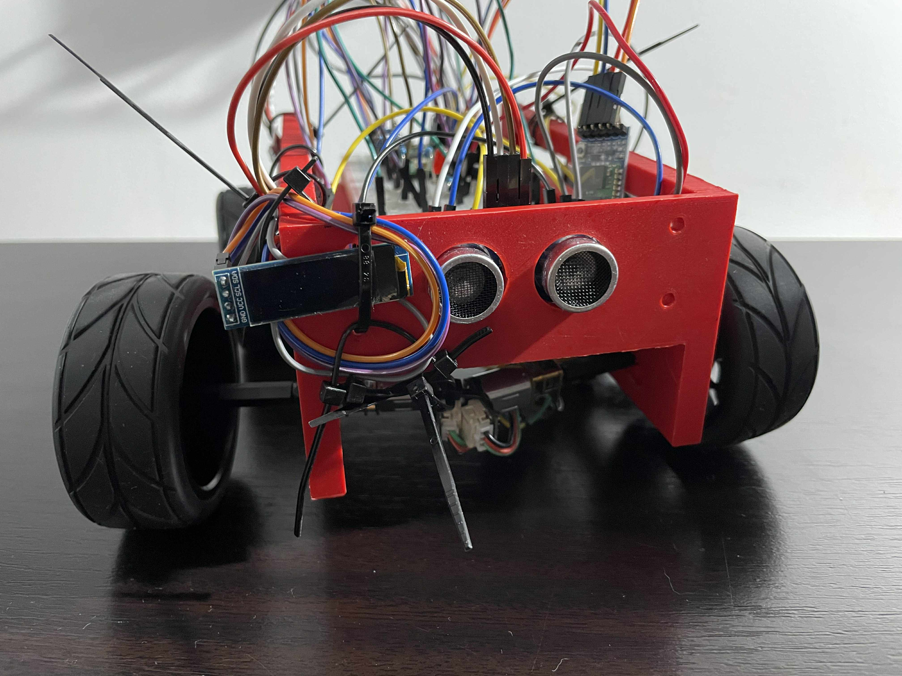
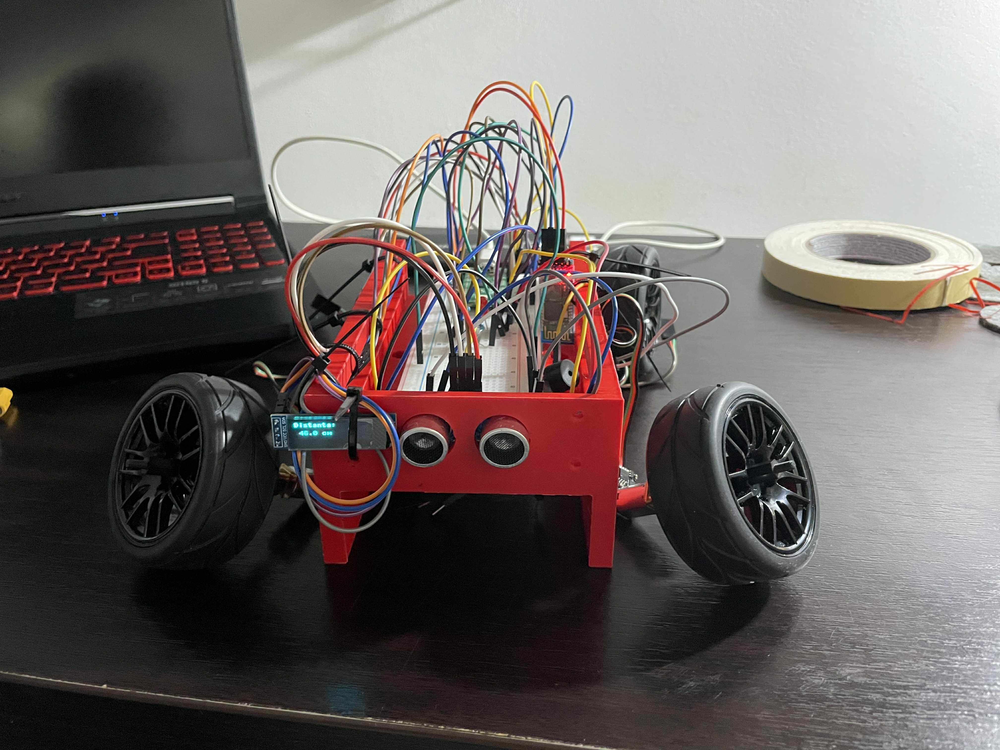
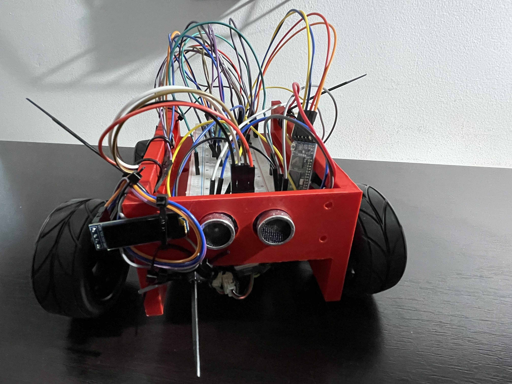
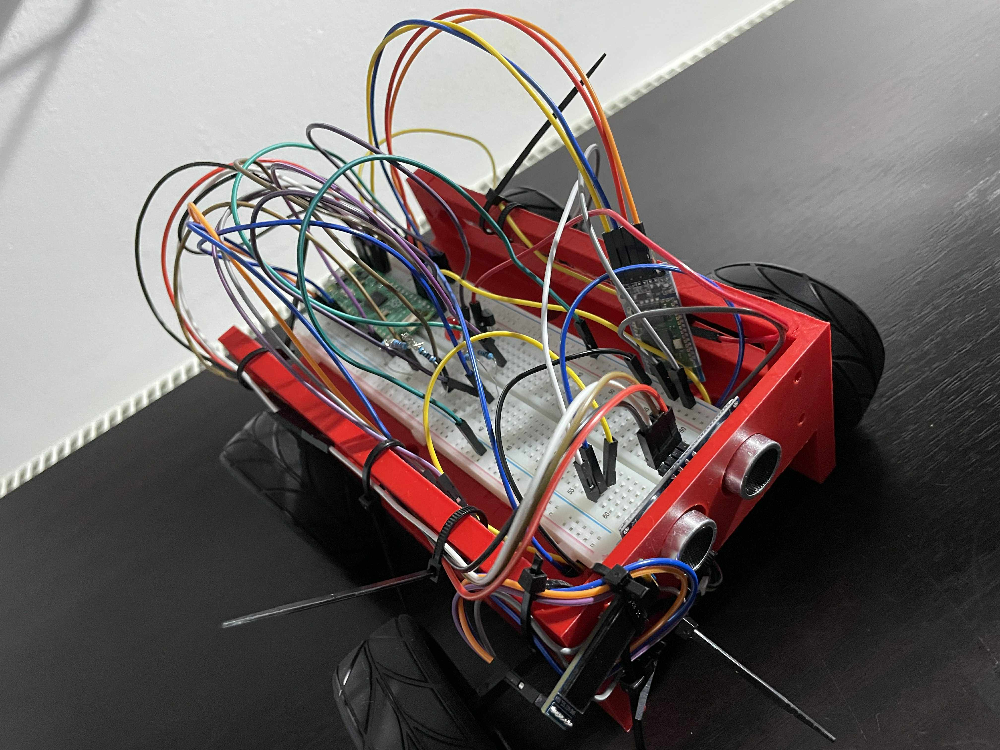

# Mini Autonomous Parking Sensor Car




## Cuprins

1. [Descriere](#descriere)  
2. [Funcționalități](#funcționalități)  
3. [Liste de componente](#liste-de-componente)  
4. [Schema de conexiuni & pinout](#schema-de-conexiuni--pinout)  
5. [Instalare software](#instalare-software)  
6. [Folosire](#folosire)  
7. [Provocări & soluții](#provocări--soluții)  
8. [Galerie foto](#galerie-foto)
9. [Contribuții](#contribuții)
10. [Resurse](#resurse) 

---

## Descriere

Acest proiect implementează o mini-mașinuță autonomă care:

- Măsoară distanța față de obstacole cu un senzor **HC-SR04**.  
- Afișează valoarea pe un ecran OLED **SSD1306**.  
- Mutește/oprește motorul la mai puțin de 40 cm și semnalizează cu un buzzer și un LED.  
- Poate fi pornită/oprivă de la distanță prin Bluetooth (HC-05) folosind comenzi seriale `s`/`x`.  

Am ales această temă deoarece consider că acoperă majoritatea laboratoarelor și are un grad ridicat de complexitate. A fost o experiență inedită să studiem mai în amănunt funcționarea microcontrolerelor.

---

## Funcționalități

- **Măsurare continuă** a distanței (HC-SR04) și afișare pe OLED.  
- **Control PWM** pentru un motor DC DFR0430.  
- **Buzzer + LED** de avertizare când un obiect se apropie sub 40 cm.  
- **Interfață Bluetooth** bidirecțională (SPP) pentru start/stop și telemetrie.  
- **Oprire la obstacol** atunci când măsurătoarea scade sub 40 cm. 

---

## Liste de componente

| Componentă                              | Cantitate | Notă                                      |
|-----------------------------------------|----------:|-------------------------------------------|
| Raspberry Pi Pico                       |         1 | Microcontroler, alimentare USB/baterie    |
| Senzor ultrasunete HC-SR04              |         1 | VCC→5 V, GND, TRIG→GP18, ECHO→GP19         |
| OLED SSD1306 128×32 I²C                 |         1 | SDA→GP4, SCL→GP5, VCC→3.3 V, GND          |
| Motor DC DFR0430 + driver               |         1 | PWM GP16 + MOSFET/NPN low-side switch     |
| Buzzer activ 5 V                        |         1 | tranzistor NPN, bază→GP6 + 1 kΩ           |
| LED + rezistor 220 Ω                    |         1 | anodă→GP15, catodă→GND                   |
| Modul Bluetooth HC-05/06                |         1 | RXD→GP0, TXD→GP1, VCC→5 V, GND, EN low     |
| Fire mama-mama, tata-tata, mama-tata    |          –| prototipare                              |
| Rezistor 220 Ω                          |         1 | dummy-load power-bank                     |
| Rezistor 10 kΩ (pull-down)              |         1 | KEY/EN HC-05 → GND (GP3)                  | 
| Baterie 7.4V                            |         1 | alimentare motoare                        |
| Baterie externă                         |         1 | alimentare Pico                           |

---

## Schema de conexiuni & pinout

```text
                     +5 V                  +7.4 V
                    ┌───┐                ┌───┐
Power-bank USB ──► VBUS(pin40)           Battery
                    └─┬─┘                └─┬─┘
                       │                   │
                       │                   │
                    VSYS(pin39)            │
                       │                   │
  ┌────────────┬───────┴───────────┬────────┴──────────┐
  │            │                   │                   │
  │          Pico                 Motor +             │
  │            │               (DFR0430 +           Breadboard
  │       ┌────▼───┐               driver)           │
  │       │  RP2040│                            HC-SR04│
  │       │  Pico  │         PWM GP16→gate MOSFET   VCC→VBUS
  │       └┬──┬─▲─┬┘                        TRIG→GP18
  │        │  │ │ │                         ECHO→GP19
  │        │  │ │ │
  │ I²C    │  │ │ │ UART0
  │ OLED   │  │ │ ├─GP0(TX)──────────► HC-05 RXD
  │ SDA←GP4│  │ │ └─GP1(RX)◄────────── HC-05 TXD
  │ SCL←GP5│  │ │
  │        │  │ │               GP3(KEY/EN)→HC-05
  │        │  │ │
  │        │  │ │
  │        │  │ │⎡Pull-down⎤
  │        │  │ │ GP3 pulled to GND
  │        │  │ │
  │        │  │ │
  │        │  │ │
  │ Buzzer │  │ │
  │ base←GP6─┘ │
  │           ╎│├─ Collector → buzzer− →5 V
  │     GND←└─Emitter→GND          │
  │                                   │
  │ LED +220Ω→GP15                      │
  │ cathode→GND                         │
  └─────────────────────────────────────┘
```
---
## Instalare software

1. **Firmware MicroPython**  
   - MicroPython pentru Raspberry Pi Pico de pe https://micropython.org/download/rp2-pico/  
2. **Editor**  
   - **Thonny IDE**:  
     - Thonny (https://thonny.org/)  
3. **Dependențe MicroPython**  
   - `time_pulse_us`, `machine`, `utime`, `ssd1306`, `I²C` 
---
## Folosire

1. **Alimentare**  
   - Conectează power-bank-ul la micro-USB sau bateria + regulator la pinul VSYS  
   - Pune rezistorul 220 Ω între VBUS și GND pentru a preveni standby  

2. **Pairing Bluetooth (PC)**  
   - În Windows: Settings → Bluetooth & devices → Add device → Bluetooth → HC-05  
   - PIN implicit: `1234`  
   - În Devices and Printers, click dreapta pe HC-05 → Properties → Services → bifează **Serial Port**  

3. **Deschidere terminal**  
   - Rulează **PuTTY**  
   - Conexiune:  
     - Serial line: COM4 (outgoing)  
     - Speed: 9600  
     - Data bits: 8, Parity: None, Stop bits: 1, Flow control: None  
     - Local echo: On  

4. **Comenzi**  
   - Tastează `s` → pornește motorul (vei primi `>> START`)  
   - Tastează `x` → oprește motorul (`>> STOP`)  
   - În modul „running”, primești constant distanțele măsurate  
   - Dacă măsoară <40 cm, motorul se oprește automat și se activează buzzer+LED  
---
## Provocări & soluții

| Problemă                         | Cauză & Soluție                                                       |
|----------------------------------|----------------------------------------------------------------------|
| **Power-bank intră în standby**  | Am adăugat o rezistență de 220 Ω între GND și 5 V.                    |
| **HC-SR04 nu răspunde**          | Am adăugat o împământare comună.                                     |
| **OLED nu afișează**             | Am ajustat dimensiunile (`128×32` vs `128×64`).                      |
| **Motorul nu pornește**          | Am adăugat o baterie separată de 6 V pentru alimentarea motorului.   |

---

## Galerie foto

<center>
  
</center>

<center>
  

</center>

---

## Contribuții

Macovei Razvan: Partea de hardware, model 3D, implementarea logică a circuitului și asamblarea mașinii.  
Chiriac Mihai: Partea de software și îmbinarea celor două ramuri Hard-Soft.  
În echipă: Documentația.

---

## Resurse

- [HC-SR04 Data Sheet](https://cdn.sparkfun.com/datasheets/Sensors/Proximity/HCSR04.pdf)  
- [SSD1306 Python Driver](https://github.com/micropython/micropython/blob/master/drivers/display/ssd1306.py)  
- [RP2040 Datasheet](https://datasheets.raspberrypi.org/rp2040/rp2040-datasheet.pdf)  
- [MicroPython on RP2 (Pico) Guide](https://docs.micropython.org/en/latest/rp2/quickref.html)  
- [HC-05 AT Commands Reference](https://www.electronica-pt.com/HC-05%20AT%20command.pdf)  
